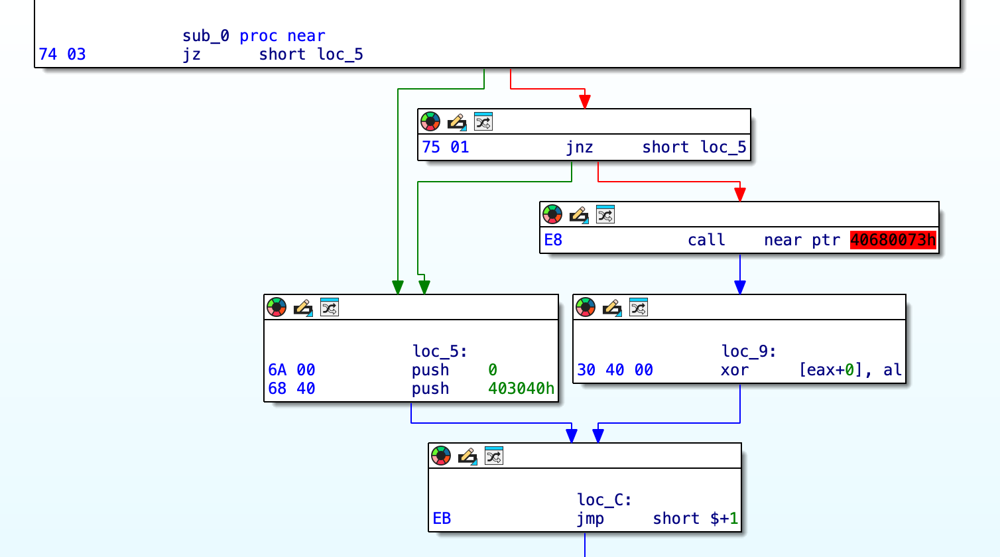

# Instrlen Plugin

The Instrlen plugin is a tool for IDA Pro that allows for setting the length of an instruction to a custom value. This can be useful when the code is obfuscated or there are jumps after the instruction prefixes.


## Installation

To install the Instrlen plugin, follow these steps:

1. Copy the `instrlen.(dll|dylib)` file to the IDA plugins folder.
2. Launch IDA Pro.
3. Go to the instruction you want to change the length of.
4. Navigate to the `Edit/Plugins` menu.
5. Choose `Change Instruction Length` from the list of plugins and enter the desired length.

## Building the Plugin

To build the Instrlen plugin, you will need to use the [ida-cmake](https://github.com/allthingsida/ida-cmake) build system.

Please refer to the ida-cmake documentation for instructions on how to set up and use the build system.

Once you have set up the ida-cmake build system, you can build the Instrlen plugin by running the following commands:

```
git clone https://github.com/milankovo/instrlen
cmake -B build64 -DEA64=YES -S src/
cmake --build build64 --config Release
```

Note: The Instrlen plugin is compatible with IDA Pro 9.0. While it has been tested with this version, it might be possible to use it with previous versions of IDA Pro. 

## Demonstration

